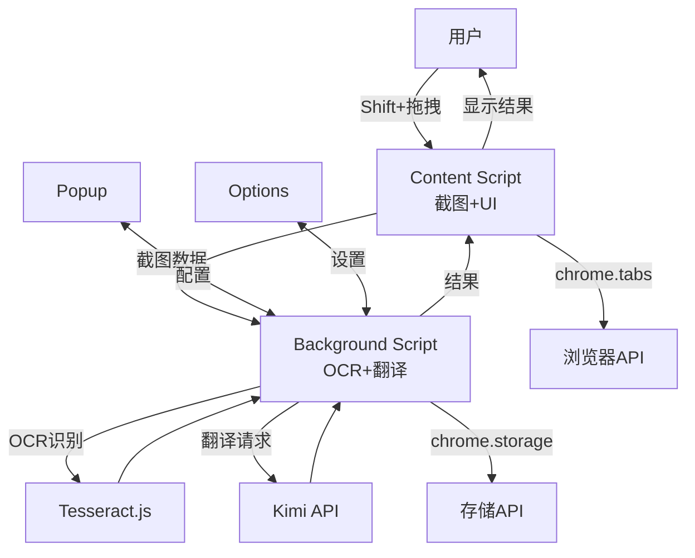
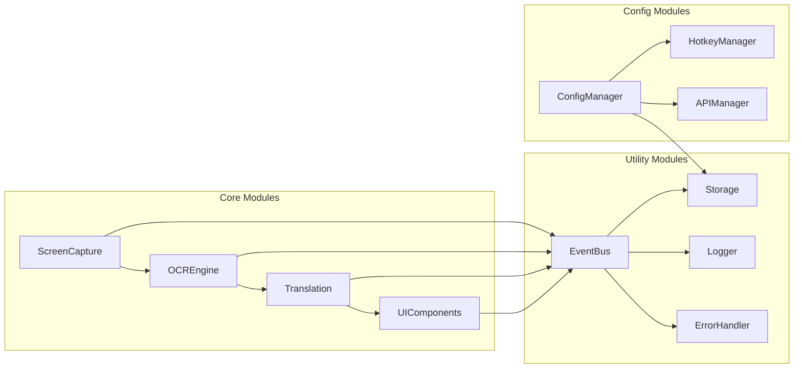
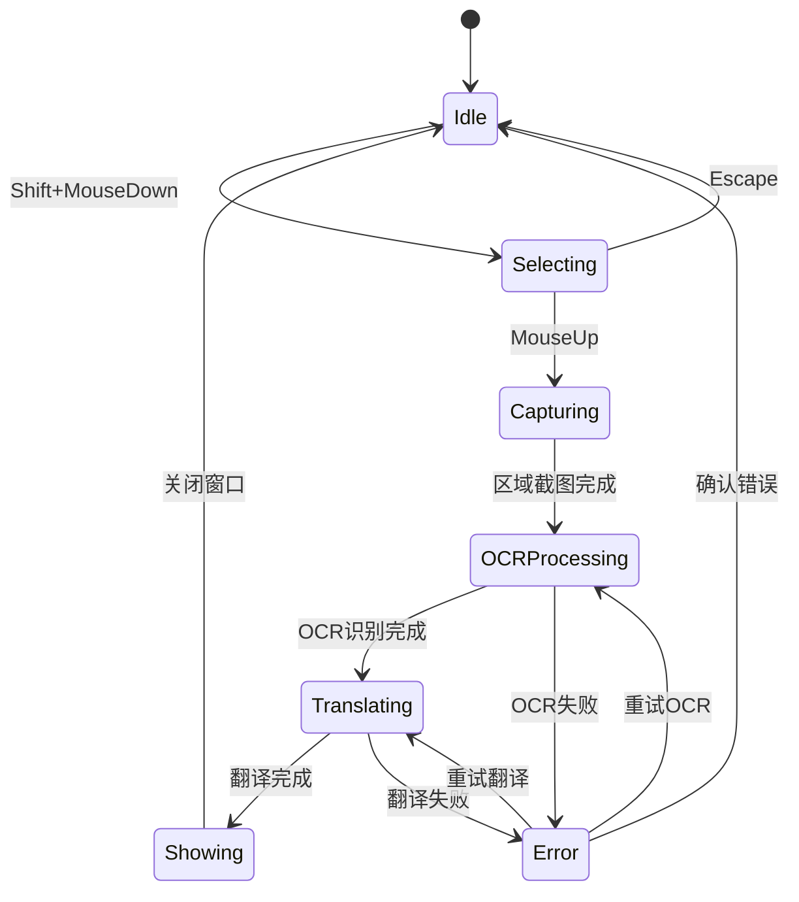
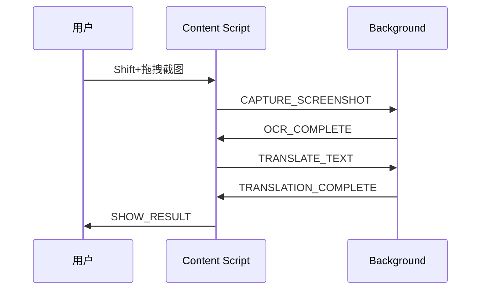

# 技术架构设计文档

## 1. 技术选型

### 1.1 核心技术栈

| 技术领域 | 选型 | 理由 |
|---------|------|------|
| **开发语言** | **TypeScript** | 类型安全提升代码质量，IDE支持更好，团队协作效率高 |
| **构建工具** | **Vite** | 快速开发体验，内置TypeScript支持，现代化构建 |
| **包管理器** | **pnpm** | 节省磁盘空间，依赖解析更准确，性能更好 |
| **UI框架** | **原生Web Components + CSS** | 轻量级，避免框架臃肿，与Chrome扩展兼容性好 |
| **CSS预处理** | **SCSS** | 强大的嵌套和变量功能，生态成熟 |
| **HTTP客户端** | **fetch API + 自定义封装** | 原生支持，无需额外依赖，更好的控制力 |
| **状态管理** | **自定义状态机** | 简单直接，避免过度工程化 |

### 1.2 核心依赖库

**运行时依赖：**
- `tesseract.js` - OCR文字识别引擎
- `eventemitter3` - 轻量级事件系统

**开发工具链：**
- TypeScript + Vite - 开发构建环境
- ESLint + Prettier - 代码质量和格式化
- Chrome Types - Chrome API类型支持

## 2. 系统架构

### 2.1 整体架构图



### 2.2 模块化架构



## 3. 数据流架构

### 3.1 状态管理设计



### 3.2 数据结构设计

```typescript
// 配置接口
interface AppConfig {
  apiKey: string;
  hotkey: 'Shift' | 'Ctrl' | 'Alt';
  prompt: string;
  languageStrategy: 'auto' | 'zh2en' | 'en2zh';
  ocrLanguages: string[];
  historyCount: number;
}

// OCR结果接口
interface OCRResult {
  text: string;
  confidence: number;
  language: string;
  processingTime: number;
}

// 翻译结果接口
interface TranslationResult {
  originalText: string;
  translatedText: string;
  sourceLanguage: string;
  targetLanguage: string;
  processingTime: number;
}

// 历史记录接口
interface HistoryRecord {
  id: string;
  timestamp: number;
  ocrResult: OCRResult;
  translationResult: TranslationResult;
  screenshotUrl?: string;
}

// 错误信息接口
interface AppError {
  code: string;
  message: string;
  details?: any;
  timestamp: number;
  retryable: boolean;
}
```

## 4. 通信架构

### 4.1 消息传递设计

```typescript
// 核心消息类型
type MessageType =
  | 'CAPTURE_SCREENSHOT'     // 触发截图
  | 'OCR_COMPLETE'          // OCR完成
  | 'TRANSLATE_TEXT'        // 请求翻译
  | 'TRANSLATION_COMPLETE'  // 翻译完成
  | 'SHOW_RESULT'           // 显示结果
  | 'CONFIG_UPDATE';        // 配置更新

// 简单的消息结构
interface Message {
  type: MessageType;
  data?: any;
  id?: string; // 仅用于需要响应的消息
}
```



### 4.2 实际通信场景

#### 1. Content Script → Background
- `CAPTURE_SCREENSHOT`: 传递截图数据
- `TRANSLATE_TEXT`: 请求翻译文本

#### 2. Background → Content Script
- `OCR_COMPLETE`: 返回OCR识别结果
- `TRANSLATION_COMPLETE`: 返回翻译结果

#### 3. Popup/Options → Background
- `CONFIG_UPDATE`: 更新用户配置

### 4.3 消息处理示例

```typescript
// Content Script 发送消息
async function sendScreenshot(imageData: string): Promise<void> {
  await chrome.runtime.sendMessage({
    type: 'CAPTURE_SCREENSHOT',
    data: { imageData }
  });
}

// Background 处理消息
chrome.runtime.onMessage.addListener((message, sender, sendResponse) => {
  switch (message.type) {
    case 'CAPTURE_SCREENSHOT':
      handleOCR(message.data.imageData);
      break;
    case 'TRANSLATE_TEXT':
      handleTranslation(message.data.text);
      break;
  }
});

// Background 发送结果
function sendOCRResult(text: string): void {
  chrome.tabs.sendMessage(sender.tab.id, {
    type: 'OCR_COMPLETE',
    data: { text }
  });
}
```

## 5. 错误处理架构

### 5.1 错误分类与处理策略

#### 错误类型分类
1. **网络错误** - API调用失败、连接超时
2. **OCR错误** - 文字识别失败、图片质量问题
3. **翻译错误** - API限制、翻译服务异常
4. **权限错误** - Chrome扩展权限不足
5. **用户操作错误** - 截图区域无效、操作中断

#### 错误处理原则
- **用户友好** - 显示易于理解的错误信息
- **可恢复性** - 提供重试机制和替代方案
- **日志记录** - 记录详细错误信息用于调试
- **优雅降级** - 部分功能失败时保持基本可用性

#### 错误处理流程
1. **错误捕获** - 在关键节点捕获异常
2. **错误分类** - 根据错误类型确定处理策略
3. **用户反馈** - 显示清晰的错误提示信息
4. **恢复机制** - 提供重试或替代操作选项
5. **错误记录** - 保存错误日志用于问题排查

## 6. 构建与部署

### 6.1 构建策略

#### 构建工具选择
- **Vite** - 现代化构建工具，快速开发和构建体验
- **TypeScript** - 类型安全，提升代码质量
- **SCSS** - CSS预处理器，支持变量和嵌套

#### 构建入口配置
Chrome扩展多入口构建：
- `background/index.ts` - 后台脚本入口
- `content/index.ts` - 内容脚本入口
- `popup/index.html` - 弹窗页面入口
- `options/index.html` - 设置页面入口

#### 构建输出策略
- **输出目录**：`dist/` 目录
- **文件命名**：保持Chrome扩展兼容的文件名格式
- **资源处理**：图标、样式等静态资源的正确复制
- **代码优化**：生产环境代码压缩和优化

### 6.2 项目组织结构

项目采用模块化架构，详细的目录结构和文件组织规范请参考：[项目结构文档](./project-structure.md)

**核心模块概览：**
- `background/` - 后台服务，处理OCR、翻译等重型任务
- `content/` - 页面脚本，处理用户交互和UI显示
- `popup/` - 扩展弹窗界面
- `options/` - 设置页面
- `shared/` - 共享模块和工具

### 6.3 开发工作流

#### 开发环境
- **热重载构建** - 文件变化时自动重新构建
- **类型检查** - TypeScript类型安全检查
- **代码质量** - ESLint + Prettier保证代码规范
- **测试支持** - 单元测试和集成测试

#### 部署流程
1. **代码构建** - 生成生产环境代码
2. **扩展打包** - 创建符合Chrome扩展标准的压缩包
3. **本地测试** - 在Chrome浏览器中加载测试
4. **商店发布** - 提交到Chrome网上应用店

#### 调试与测试
- **开发者模式** - Chrome扩展管理页面加载未打包扩展
- **控制台调试** - Background、Content、Popup独立调试
- **跨页面测试** - 不同网站环境下的功能验证
- **权限测试** - 确保扩展权限正确配置和使用

---

这个技术架构设计为项目提供了清晰的技术路线图，确保开发过程中的一致性和可维护性。